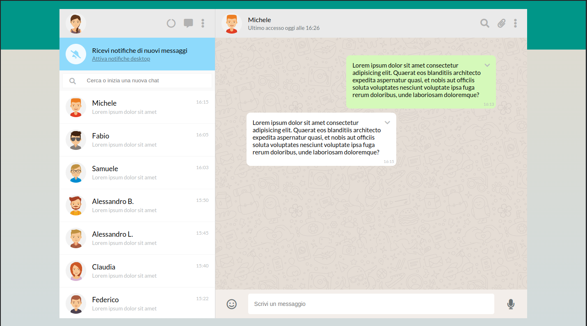
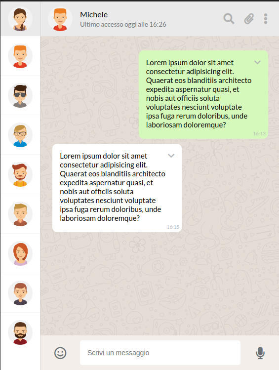
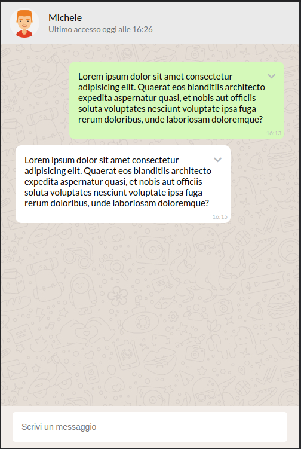

# Boolzapp Layout - Layout resposive di una Webapp

Questa è una soluzione per eseguire questo esercizio puramente dal lato visivo con il solo uso di HTML e di CSS custom.

## Sommario

- [Panoramica](#Panoramica)
  - [La sfida](#La-sfida)
  - [Screenshot](#screenshot)
- [Il mio processo](#il-mio-processo)
  - [Osservazioni](#osservazioni)
  - [Costruito con](#costruito-con)
  

## Panoramica

### La sfida

Il layout di questo esercizio è diverso da classiche pagine web: il contenuto della pagina non potrà mai uscire dalla viewport, proprio come una app!
In allegato troverete le screenshot per vedere il layout anche nelle versioni responsive.

### Screenshot

**Layout Desktop**



**Layout Tablet**



**Layout Mobile**



## Il mio processo
Per prima cosa costruisco il layout responsive di base senza stili.
Ho implementato le varie sezioni con lo stile. 
Successivamente ho aggiunto le transizioni e i contenuti all'hover.
In fine ho implementato la dark mode utilizzando le media (prefers-color-scheme).

## Osservazioni
Molto interessante il comportamento della sezione FOOTER-REGISTRATION, ho voluto utilizzare e stilizzare un details tag utilizzando la proprietà open e il **selettore avanzato css "has"**, riscontrando la **corretta esecuzione in Chrome** ma il **mancato funzionamento in Firefox**

**Sezione html Footer-registration**
```html
<div class="footer-registration">
    <details>
        <summary>
        </summary>
        <div class="det-main flex">
            <button class="icons">
                <i class="fa-solid fa-trash"></i>
            </button>
            <div>
                timer 
            </div>
            <div>..........</div>
            <button class="icons">
                <i class="fa-solid fa-pause"></i>
            </button>
            <button class="icons">
                <i class="fa-regular fa-paper-plane"></i>
            </button>
        </div>
    </details>
</div>
```

**Sezione css Footer-registration**
```css

details {
   justify-content: space-between;
   align-items: center;
   position: relative;
}

summary {
    display: block;
}

summary:after  {
    display: flex;
    align-items: center;
    justify-content: center;
    width: 2.5rem;
    height: 2.5rem;
    border-radius: 50%;
    content: "\f130";
    font-size: 1.2rem;
    color: var(--color-gray-icons-footer);
    font-family: 'FontAwesome';
    cursor: pointer;
}

summary:hover:after { 
    color: var(--color-microphone-hover);
    background-color: var(--glow-color);
}

.det-main.flex {  
    width: 100%;
    align-items: center;
    position: absolute;
    gap: .5rem;
    right: 200px;
    bottom: 2px;
}

.footer-registration .icons {
    margin: 5px;
}

footer:has(details[open]) .footer-text form.text {
    display: none;
    /*per variare la lunghezza */
   /* width: calc(100% - 275px); */
}

footer:has(details[open]) .footer-text button.glowing-btn {
    display: none;
}
```

### Costruito con

- Semantica HTML5 markup
- Flexbox
- CSS Grid
- Desktop-first workflow
